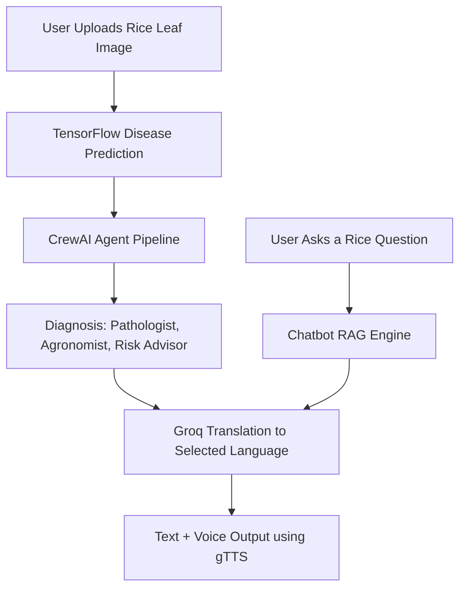

# 🌾 Rice Disease Detection & Chatbot Assistant

An advanced AI-powered web application for detecting rice leaf diseases from images, generating multilingual expert diagnosis, and answering agricultural queries via chatbot—all deployed with Gradio on Hugging Face Spaces.

---

## 📌 Overview

This app intelligently detects rice leaf diseases using a deep learning model and provides a comprehensive diagnosis report using CrewAI agents. It supports **English, Urdu, and Hindi** outputs and generates voice notes for farmer-friendly interaction.

---

## 🎯 Key Features

- ✅ Detect 10 types of rice leaf diseases using a trained CNN model.
- 🧠 Multi-agent diagnosis pipeline using **CrewAI + OpenAI API**.
- 🌍 Multilingual translation (English, Urdu, Hindi) via **Groq API**.
- 🔊 Voice note generation using **gTTS** for easy understanding.
- 🤖 Built-in agriculture-themed **chatbot** for rice-related queries.

---

## 🧪 Tech Stack

### 🎨 Frontend
- [Streamlit](https://streamlit.io/): UI for file upload, language selection, and chatbot.
- [Hugging Face Spaces](https://huggingface.co/spaces): Deployment platform.

### 🧠 Backend
- **TensorFlow/Keras**: Rice disease image classification model.
- **CrewAI**: Multi-agent system for diagnosis logic.
- **OpenAI API**: LLM-powered agents (Pathologist, Agronomist, Risk Advisor).
- **Groq API**: Fast LLM inference and translation.
- **LangChain**: Tool chaining and agent orchestration.
- **gTTS**: Text-to-speech audio generation.
- **FAISS + SentenceTransformer**: Chatbot RAG response system.

---

## 🧬 Architecture



---

## 🤖 CrewAI Agents

- **Pathologist Agent**: Explains disease cause and symptoms.
- **Agronomist Agent**: Suggests treatment and crop care.
- **Risk Advisor Agent**: Evaluates disease severity and urgency.

---

## 🌍 Language Support

| Language | Text Output | Voice Note |
|----------|-------------|------------|
| English  | ✅           | ✅          |
| Urdu     | ✅           | ✅          |
| Hindi    | ✅           | ✅          |

---

## 🚀 How to Run Locally

1. Clone this repository or download files.
2. Add your API keys in environment variables:
   - `GROQ_API_KEY`
   - `OPENAI_API_KEY`
3. Install dependencies:
   ```bash
   pip install -r requirements.txt
   ```
4. Run the app:
   ```bash
   python app.py
   ```

---

## 🏗️ Deployment (Hugging Face Spaces)

1. Create a new Space → **Gradio + Python**.
2. Upload:
   - `app.py`
   - `model.h5`
   - `rice_chatbot.py`
   - `crew_agents.py`
   - `requirements.txt`
3. Add API keys in "Secrets":
   - `GROQ_API_KEY`
   - `OPENAI_API_KEY`
4. Click **Deploy**.

---

## 📦 File Structure

```
📁 cropdoctor/
├── app.py                # Main Gradio app
├── model.h5              # Trained rice disease model
├── rice_chatbot.py       # Chatbot component
├── crew_agents.py        # CrewAI agent setup
├── requirements.txt      # Python dependencies
```

---

## 🙌 Credits

- 🧑‍💻 Developed by 
- `AHMAD SANA FAROOQ (BACKEND INTELLIGENCE STACK)`
- `HASHIR AWAIZ (MODEL DEVELOPMENT)`
- `RIDA YOUSUF (STRUCTURE BUILD & DIAGRAMS)`
- `TEMOOR IQBAL (FRONTEND)`
- `FAIZA KANWAL (DOCUMENTATION )`
- `EMAN (PRESENTATION)`

---

## 📜 License

This project is open-source and available under the MIT License.
